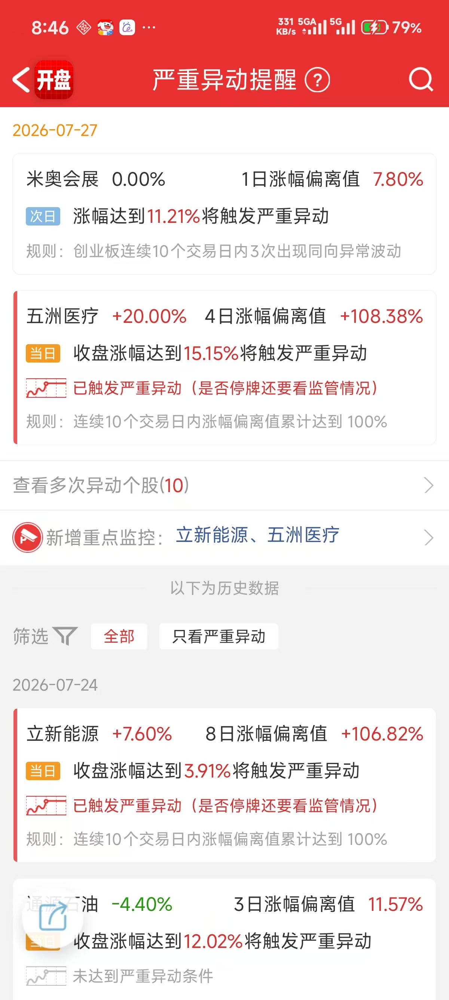
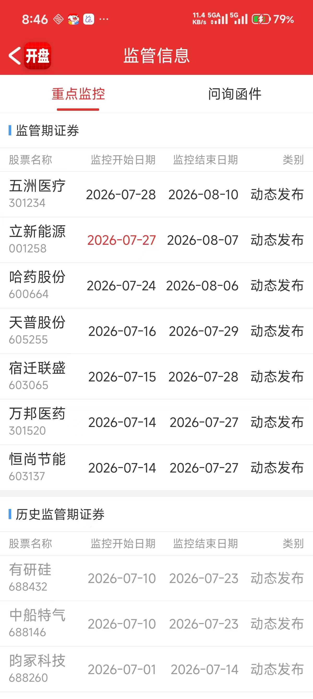

# 监管与异动

# 2026-07-27 A股市场复盘

> 本文为历史盘面研究，不构成任何投资建议。

## 行情背景

7月24日，AI应用、算力租赁、有色和电力等前期强势方向集中回撤，市场处于高位题材补跌与连板高度压缩阶段；半导体设备相对抗跌，但尚未带动风险偏好回升。

7月27日，市场出现放量普涨修复，医药、脑机接口、电池、机器人和PCB等方向同时走强。短线收盘数据为涨停111家、连板8家、最高5板、炸板13家；前一日首板的1进2晋级率仅13%。因此，当日赚钱效应很强，但连板梯队的晋级质量仍不足以证明单一新主线已经确认。

## 明确日期拐点

| 日期 | 阶段 | 发生情况 | 复盘判断 |
| --- | --- | --- | --- |
| 2026-07-24 | 退潮 | 前期强势方向回撤，连板高度压缩至4板。 | 高位方向进入风险释放，半导体设备的相对抗跌仅是候选承接信号。 |
| 2026-07-27 | 修复 | 市场放量普涨，医药、脑机接口、电池、机器人和PCB同时扩散；最高连板升至5板。 | 属于情绪修复确认日，而非新主线确认日；次日应观察高标反馈、首板晋级和板块是否继续收敛。 |

## 板块与个股角色

### 情绪高标

| 个股 | 代码 | 所属方向 | 7月27日角色 | 后续确认与失效信号 |
| --- | --- | --- | --- | --- |
| 爱丽家居 | 603221 | 家居用品 | 5连板、当日空间高标。家居方向虽有多只涨停，但产业线条较弱，主要承担短线情绪锚点。 | 确认：高位分歧后仍有同题材补涨并保持封板质量。失效：断板且家居后排同步走弱。 |
| 五洲医疗 | 301234 | 医药生物 | 4连板，创新药走强后的高位情绪核心之一。 | 确认：医药继续扩散并出现中低位晋级。失效：高位断板且创新药、医疗服务同步回落。 |
| 长城军工 | 601606 | 军工 | 3连板，承接军工事件窗口预期，属于独立题材高标。 | 确认：军工新增首板与二板并跟随放量。失效：仅剩个股连板、板块无跟随。 |

### 产业催化与连板

| 个股 | 代码 | 所属方向 | 7月27日角色 | 后续确认与失效信号 |
| --- | --- | --- | --- | --- |
| 至纯科技 | 603690 | 半导体设备 | 2连板。长鑫科技上市带来国产存储及设备关注度，承担设备端的短线辨识度。 | 确认：设备、材料、封测等细分继续扩散，且趋势中军不走弱。失效：新股事件热度消退后，仅个股维持强势。 |
| 圣阳股份 | 002580 | 储能电池、数据中心备电 | 电池方向涨停代表，市场将其与储能、算力备电预期关联。 | 确认：电池方向持续有首板、二板补充，且储能需求逻辑获得订单或业绩验证。失效：仅概念催化、板块无法形成梯队。 |
| 龙蟠科技 | 603906 | 锂电材料 | 电池产业链扩散标的，反映资金对锂电排产预期的修复。 | 确认：材料、设备、电池同步走强，形成产业链而非单点涨停。失效：锂电仅日内脉冲，次日无晋级和容量承接。 |

### 医药与脑机接口弹性

| 个股 | 代码 | 所属方向 | 7月27日角色 | 后续确认与失效信号 |
| --- | --- | --- | --- | --- |
| 创新医疗 | 002173 | 脑机接口、医疗 | 3天2板，脑机接口扩散中的连板辨识度标的。 | 确认：脑机接口从事件驱动扩展至更多公司，且连板梯队不断档。失效：高开回落、板块只剩少数20CM个股。 |
| 爱朋医疗 | 300753 | 脑机接口、医疗器械 | 20CM涨停，提供板块弹性，但不宜单独定义主线。 | 确认：20CM与主板标的共同延续，形成多层次梯队。失效：次日大幅溢价回落且无主板承接。 |

### 容量趋势观察

| 个股 | 代码 | 所属方向 | 7月27日角色 | 后续确认与失效信号 |
| --- | --- | --- | --- | --- |
| 北方华创 | 002371 | 半导体设备 | 国产设备方向的容量趋势观察标的，不以连板高度取胜，用于验证设备线是否获得机构承接。 | 确认：成交与趋势同步改善、设备细分持续扩散。失效：事件落地后放量走弱，且至纯科技等高辨识度标的无法延续。 |

## 复盘结论与风险

7月27日完成的是从7月24日退潮后的强修复：高标、20CM、产业链弹性和容量方向都获得资金参与。热点较多且并行，尚未出现一条同时具备持续梯队、容量中军与分歧承接能力的统一主线。

后续不应只看当日涨停数量，而应验证高标能否经受分歧、首板能否稳定晋级，以及半导体设备或电池等产业方向能否由事件催化转为连续的板块扩散。若普涨后快速缩量回落，或高标与后排同步转弱，则7月27日应定性为退潮后的修复脉冲，而非新周期起点。

## 来源与口径

- [连板网：2026年7月27日A股复盘](https://lianban.net/days/2026-07-27.html)：涨停、连板、炸板及首板晋级等短线数据。
- [澎湃新闻：7月27日A股盘面报道](https://www.thepaper.cn/newsDetail_forward_33666628)：成交额、板块涨跌与当日盘面表现。
- [金融界：7月27日午间涨停快报](https://m.jrj.com.cn/madapter/finance/2026/07/27123057907731.shtml)：连板梯队和板块涨停分布。
- [北方华创2025年年度报告](https://static.cninfo.com.cn/finalpage/2026-04-18/1225122918.PDF)：半导体设备业务与行业背景。
- [龙蟠科技2025年年度报告](https://dataclouds.cninfo.com.cn/shgonggao/hsomarket/2026/20260424/7d95dbe4155d44f09a2d611e4d71a485.PDF)：磷酸铁锂材料业务及产能信息。
- [圣阳股份2025年度业绩说明会](https://irm.cninfo.com.cn/interview/interview/activityInfo?activityId=1439495208935104512)：储能及数据中心备电相关公开回复。

不同数据平台因统计范围与收盘定版时间不同，涨跌停家数可能存在差异；本文的短线数据以连板网收盘口径为准。
